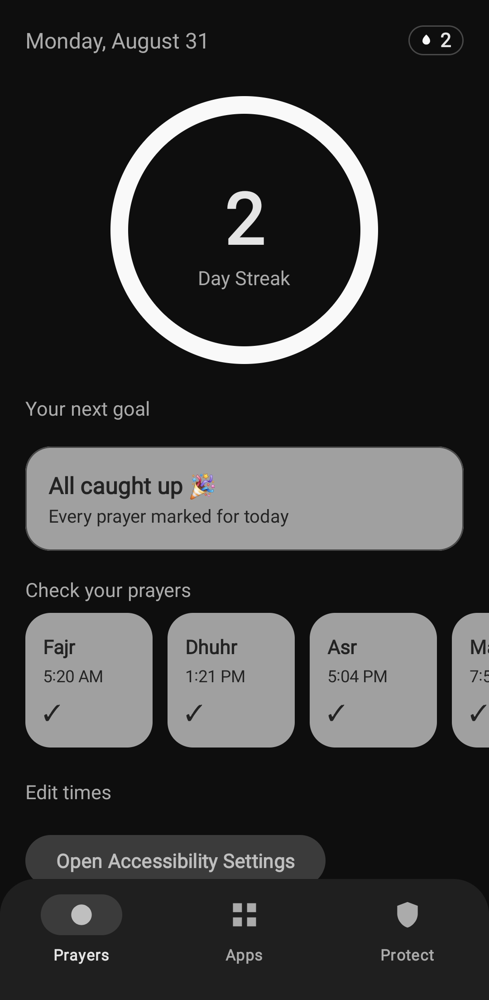
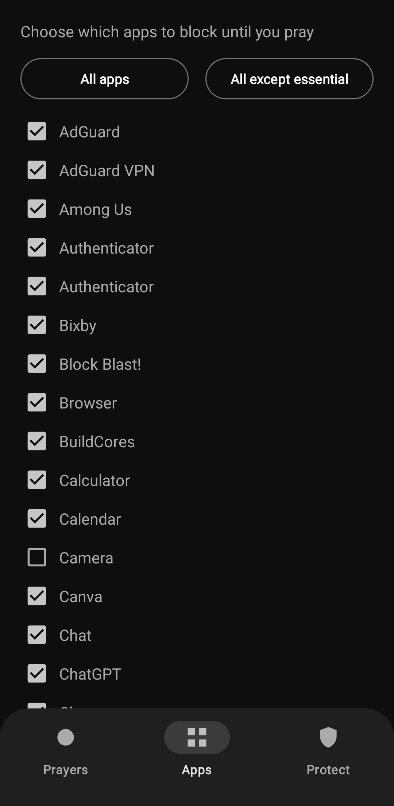
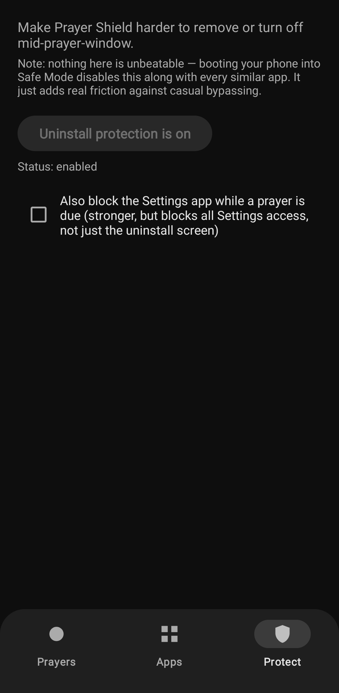

# 🛡️ Prayer Shield

**Prayer Shield** is a focus and mindfulness app designed to help you maintain your daily prayer habit. It creates a gentle "shield" over your most distracting apps during prayer times, requiring you to mark your prayer as completed before regaining access.

---

## ✨ Features

- **Habit-Building Shield**: Automatically blocks selected apps when it's time to pray.
- **Fajr Grace Period**: Special logic for Fajr allowing it to be marked until the end of Dhuhr, accommodating for early morning schedules.
- **Minimalistic Dashboard**: Clean, Material 3 interface with a sleek daily streak tracker.
- **Interactive Widgets**:
  - **Status Widget**: Quick overview of your current progress.
  - **Grid Widget**: Detailed view of all prayers.
  - **Lockscreen Support**: Mark prayers as done without even unlocking your phone.
- **Automatic Prayer Times**: Estimates times based on your current location using modern Android Location APIs.
- **Uninstall Protection**: Includes an optional device administrator mode to prevent accidental removal during focused sessions.

## 📱 Screenshots

<p align="center">
  
  
  
</p>

## 🚀 Getting Started

### Prerequisites
- Android 7.0 (API 24) or higher.
- Optimized for **Android 15+** and **Android 16 (Baklava)**.

### Installation
1. Download the latest APK from the [Releases](https://github.com/darkswich1234-ux/PrayerShieldApp/releases) page.
2. Enable **Accessibility Services** for Prayer Shield (this is required to detect when blocked apps are opened).
3. (Optional) Enable **Device Administrator** in the "Protect" tab for enhanced uninstall protection.

## 🛠️ Development

### Built With
- **Kotlin**: Primary programming language.
- **Material 3**: Modern design system.
- **Jetpack Libraries**: Core-KTX, Activity-KTX, Appcompat.

### Build Instructions
```bash
git clone https://github.com/darkswich1234-ux/PrayerShieldApp.git
cd PrayerShieldApp
./gradlew assembleDebug
```

## 🤝 Contributing
Contributions are welcome! Whether it's translating the app into a new language or adding a new feature, feel free to open a Pull Request.

1. Fork the Project
2. Create your Feature Branch (`git checkout -b feature/AmazingFeature`)
3. Commit your Changes (`git commit -m 'Add some AmazingFeature'`)
4. Push to the Branch (`git push origin feature/AmazingFeature`)
5. Open a Pull Request

## 📄 License
This project is licensed under the GNU General Public License v3.0

---
*Developed with focus and intent.*
